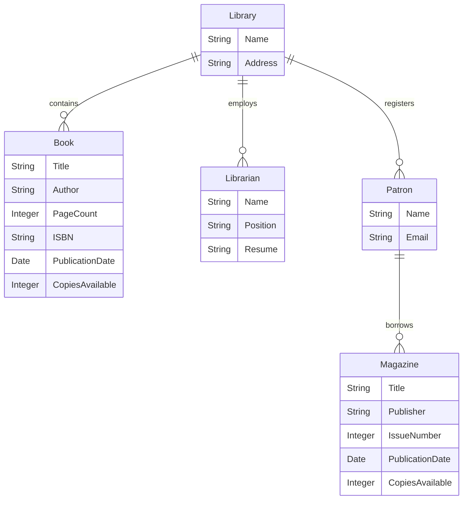
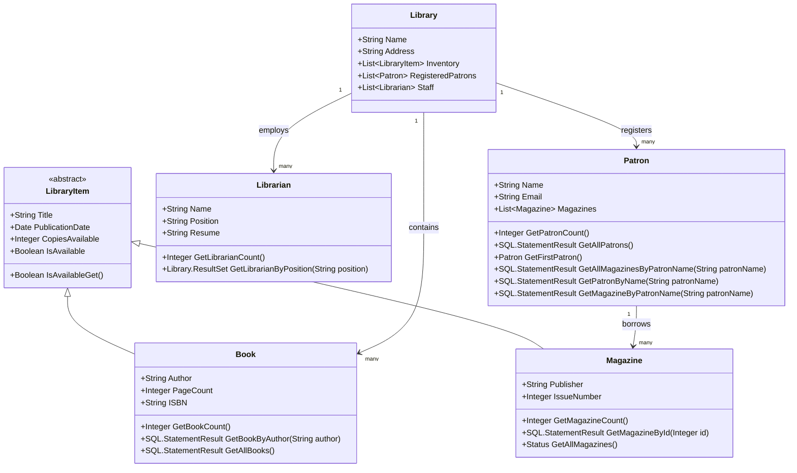
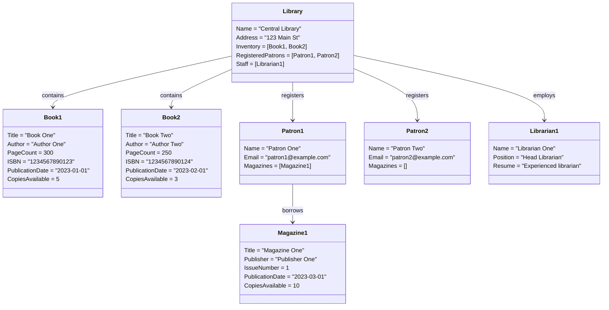
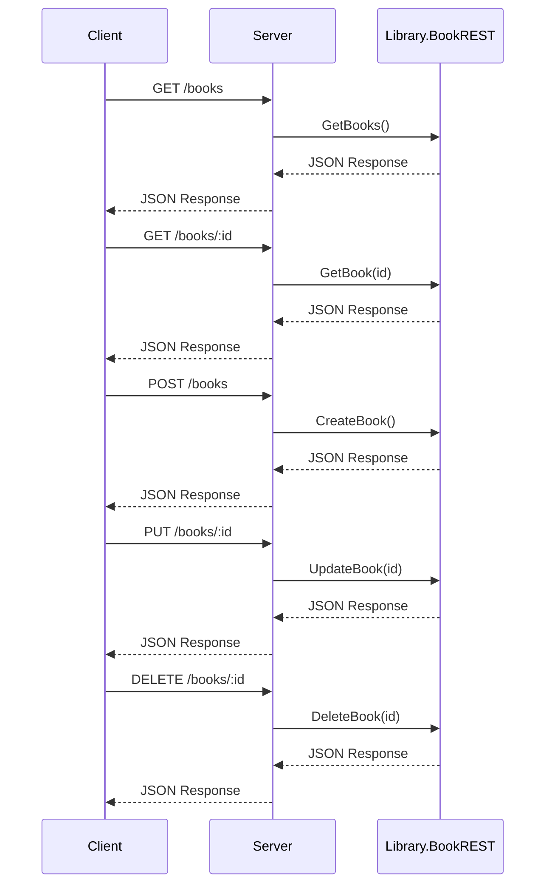
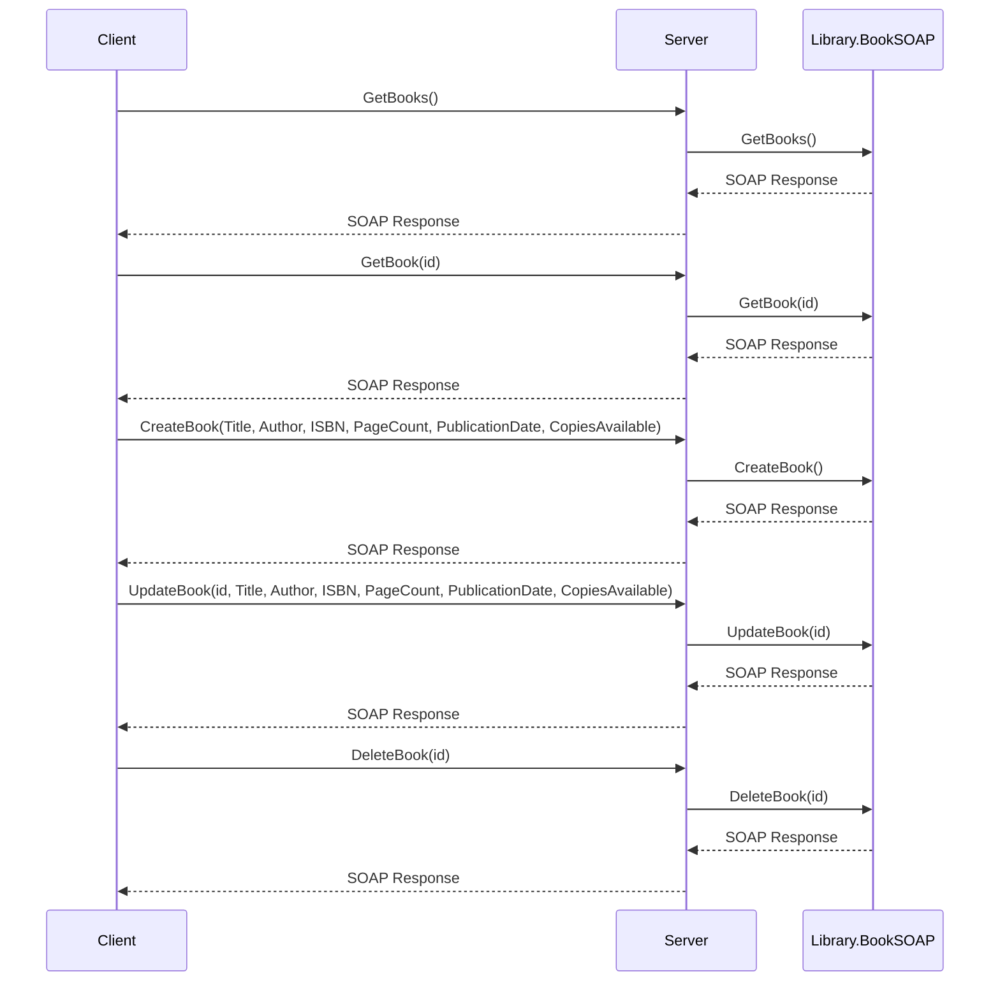
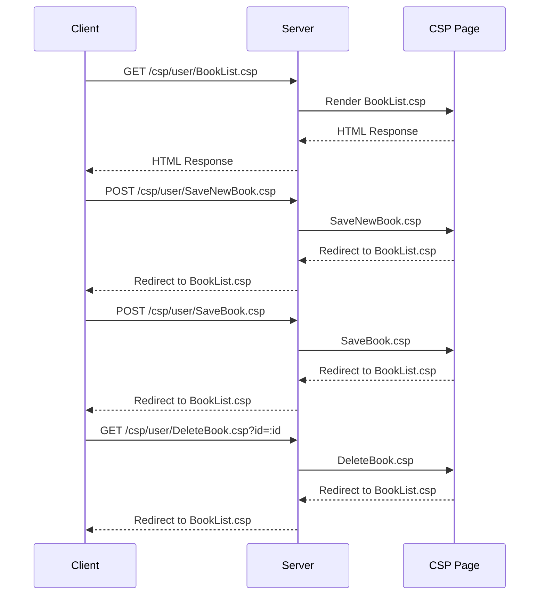

# Diagrams

## 1. Схема реляційної БД

```mermaid
erDiagram
    Library {
        String Name
        String Address
    }
    Book {
        String Title
        String Author
        Integer PageCount
        String ISBN
        Date PublicationDate
        Integer CopiesAvailable
    }
    Librarian {
        String Name
        String Position
        String Resume
    }
    Patron {
        String Name
        String Email
    }
    Magazine {
        String Title
        String Publisher
        Integer IssueNumber
        Date PublicationDate
        Integer CopiesAvailable
    }
    Library ||--o{ Book: contains
    Library ||--o{ Librarian: employs
    Library ||--o{ Patron: registers
    Patron ||--o{ Magazine: borrows

```

## 2. Діаграма класів

```mermaid
classDiagram
    class Library {
        +String Name
        +String Address
        +List~LibraryItem~ Inventory
        +List~Patron~ RegisteredPatrons
        +List~Librarian~ Staff
    }
    class LibraryItem {
        <<abstract>>
        +String Title
        +Date PublicationDate
        +Integer CopiesAvailable
        +Boolean IsAvailable
        +Boolean IsAvailableGet()
    }
    class Book {
        +String Author
        +Integer PageCount
        +String ISBN
        +Integer GetBookCount()
        +SQL.StatementResult GetBookByAuthor(String author)
        +SQL.StatementResult GetAllBooks()
    }
    class Librarian {
        +String Name
        +String Position
        +String Resume
        +Integer GetLibrarianCount()
        +Library.ResultSet GetLibrarianByPosition(String position)
    }
    class Patron {
        +String Name
        +String Email
        +List~Magazine~ Magazines
        +Integer GetPatronCount()
        +SQL.StatementResult GetAllPatrons()
        +Patron GetFirstPatron()
        +SQL.StatementResult GetAllMagazinesByPatronName(String patronName)
        +SQL.StatementResult GetPatronByName(String patronName)
        +SQL.StatementResult GetMagazineByPatronName(String patronName)
    }
    class Magazine {
        +String Publisher
        +Integer IssueNumber
        +Integer GetMagazineCount()
        +SQL.StatementResult GetMagazineById(Integer id)
        +Status GetAllMagazines()
    }
    LibraryItem <|-- Book
    LibraryItem <|-- Magazine
    Library "1" --> "many" Book : contains
    Library "1" --> "many" Librarian : employs
    Library "1" --> "many" Patron : registers
    Patron "1" --> "many" Magazine : borrows
```

## 3. Діаграма об’єктів

```mermaid
classDiagram
    class Library {
        Name = "Central Library"
        Address = "123 Main St"
        Inventory = [Book1, Book2]
        RegisteredPatrons = [Patron1, Patron2]
        Staff = [Librarian1]
    }
    class Book1 {
        Title = "Book One"
        Author = "Author One"
        PageCount = 300
        ISBN = "1234567890123"
        PublicationDate = "2023-01-01"
        CopiesAvailable = 5
    }
    class Book2 {
        Title = "Book Two"
        Author = "Author Two"
        PageCount = 250
        ISBN = "1234567890124"
        PublicationDate = "2023-02-01"
        CopiesAvailable = 3
    }
    class Patron1 {
        Name = "Patron One"
        Email = "patron1@example.com"
        Magazines = [Magazine1]
    }
    class Patron2 {
        Name = "Patron Two"
        Email = "patron2@example.com"
        Magazines = []
    }
    class Librarian1 {
        Name = "Librarian One"
        Position = "Head Librarian"
        Resume = "Experienced librarian"
    }
    class Magazine1 {
        Title = "Magazine One"
        Publisher = "Publisher One"
        IssueNumber = 1
        PublicationDate = "2023-03-01"
        CopiesAvailable = 10
    }
    Library --> Book1 : contains
    Library --> Book2 : contains
    Library --> Patron1 : registers
    Library --> Patron2 : registers
    Library --> Librarian1 : employs
    Patron1 --> Magazine1 : borrows
```

## 4. Діаграма послідовності

### REST Endpoints

```mermaid
sequenceDiagram
    participant Client
    participant Server
    participant Library.BookREST

    Client->>Server: GET /books
    Server->>Library.BookREST: GetBooks()
    Library.BookREST-->>Server: JSON Response
    Server-->>Client: JSON Response

    Client->>Server: GET /books/:id
    Server->>Library.BookREST: GetBook(id)
    Library.BookREST-->>Server: JSON Response
    Server-->>Client: JSON Response

    Client->>Server: POST /books
    Server->>Library.BookREST: CreateBook()
    Library.BookREST-->>Server: JSON Response
    Server-->>Client: JSON Response

    Client->>Server: PUT /books/:id
    Server->>Library.BookREST: UpdateBook(id)
    Library.BookREST-->>Server: JSON Response
    Server-->>Client: JSON Response

    Client->>Server: DELETE /books/:id
    Server->>Library.BookREST: DeleteBook(id)
    Library.BookREST-->>Server: JSON Response
    Server-->>Client: JSON Response
```

### SOAP Endpoints

```mermaid
sequenceDiagram
    participant Client
    participant Server
    participant Library.BookSOAP

    Client->>Server: GetBooks()
    Server->>Library.BookSOAP: GetBooks()
    Library.BookSOAP-->>Server: SOAP Response
    Server-->>Client: SOAP Response

    Client->>Server: GetBook(id)
    Server->>Library.BookSOAP: GetBook(id)
    Library.BookSOAP-->>Server: SOAP Response
    Server-->>Client: SOAP Response

    Client->>Server: CreateBook(Title, Author, ISBN, PageCount, PublicationDate, CopiesAvailable)
    Server->>Library.BookSOAP: CreateBook()
    Library.BookSOAP-->>Server: SOAP Response
    Server-->>Client: SOAP Response

    Client->>Server: UpdateBook(id, Title, Author, ISBN, PageCount, PublicationDate, CopiesAvailable)
    Server->>Library.BookSOAP: UpdateBook(id)
    Library.BookSOAP-->>Server: SOAP Response
    Server-->>Client: SOAP Response

    Client->>Server: DeleteBook(id)
    Server->>Library.BookSOAP: DeleteBook(id)
    Library.BookSOAP-->>Server: SOAP Response
    Server-->>Client: SOAP Response
```

### CSP Endpoints

```mermaid
sequenceDiagram
    participant Client
    participant Server
    participant CSP Page

    Client->>Server: GET /csp/user/BookList.csp
    Server->>CSP Page: Render BookList.csp
    CSP Page-->>Server: HTML Response
    Server-->>Client: HTML Response

    Client->>Server: POST /csp/user/SaveNewBook.csp
    Server->>CSP Page: SaveNewBook.csp
    CSP Page-->>Server: Redirect to BookList.csp
    Server-->>Client: Redirect to BookList.csp

    Client->>Server: POST /csp/user/SaveBook.csp
    Server->>CSP Page: SaveBook.csp
    CSP Page-->>Server: Redirect to BookList.csp
    Server-->>Client: Redirect to BookList.csp

    Client->>Server: GET /csp/user/DeleteBook.csp?id=:id
    Server->>CSP Page: DeleteBook.csp
    CSP Page-->>Server: Redirect to BookList.csp
    Server-->>Client: Redirect to BookList.csp
```
